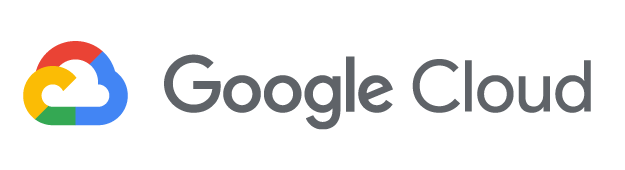

# Awesome GCP 

A curated list of awesome GCP libraries, open source repos, guides, blogs, books, and other resources.

Inspired by the [awesome](https://github.com/sindresorhus/awesome) list.

## The Fiery Meter of Awesome

* Repo with 0100+ Stars: :fire:
* Repo with 0200+ Stars: :fire::fire:
* Repo with 0500+ Stars: :fire::fire::fire:
* Repo with 1000+ Stars: :fire::fire::fire::fire:
* Repo with 2000+ Stars: :fire::fire::fire::fire::fire:

Repos not on `The Fiery Meter of Awesome` can still be awesome, see [A Note on Repo Awesomeness](https://github.com/morx3x/awesome-gcp/blob/main/CONTRIBUTING.md#a-note-on-repo-awesomeness).

## Contributing

Contributions are welcome!

Review the [Contributing Guidelines](https://github.com/morx3x/awesome-gcp/blob/main/CONTRIBUTING.md).

## Index

* [SDKs and Samples](#sdks-and-samples)
    * [Android](#android-sdk)
    * [C++](#c-sdk)
    * [Clojure](#clojure-sdk)
    * [Go](#go-sdk)
    * [iOS](#ios-sdk)
    * [IoT](#iot-sdk)
    * [Java](#java-sdk)
    * [JavaScript](#javascript-sdk)
    * [Haskell](#haskell-sdk)
    * [Perl](#perl-sdk)
    * [PHP](#php-sdk)
    * [Python](#python-sdk)
    * [Ruby](#ruby-sdk)
    * [Rust](#rust-sdk)
    * [Scala](#scala-sdk)
    * [Xamarin](#xamarin-sdk)
    * [Unity](#unity-sdk)
    * [.NET](#net-sdk)
* [Command Line Tools](#command-line-tools)
    * [Universal Command Line Interface](#universal-command-line-interface)
    * [Windows PowerShell](#windows-powershell)
* [IDE Toolkits](#ide-toolkits)
    * [Eclipse Toolkit](#eclipse-toolkit)
    * [Visual Studio Toolkit](#visual-studio-toolkit)
    * [IntelliJ Toolkit](#intellij-toolkit)
* [Open Source Repos](#open-source-repos)
* [Guides, Books, Documentation, and Training](#guides-books-documentation-and-training)
    * [Getting Started Guides](#getting-started-guides)
    * [General Guides](#general-guides)
    * [Books](#books)
    * [Whitepapers](#whitepapers)
    * [Documentation](#documentation)
    * [Training](#training)
    * [Case Studies: Powered by GCP](#case-studies-powered-by-gcp)
* [Social](#social)
    * [Blogs](#blogs)
    * [Twitter Influencers](#twitter-influencers)
    * [Facebook Pages](#facebook-pages)
    * [YouTube Channels](#youtube-channels)
    * [LinkedIn Groups](#linkedin-groups)
    * [Subreddits](#subreddits)
    * [Conferences](#conferences)
* [Latest KPIs and Stats](#latest-kpis-and-stats)
* [Appendix of Core Services](#appendix-of-core-services)
    * [Services in Plain English](#services-in-plain-english)
    * [Compute](#compute-services)
    * [Networking](#networking-services)
    * [Enterprise Applications](#enterprise-applications)
    * [Analytics](#analytics-services)
    * [Artificial Intelligence](#artificial-intelligence)
    * [Management Tools](#management-tools)
    * [Security and Identity](#security-and-identity-services)
    * [Internet of Things](#internet-of-things-service)
    * [Mobile Services](#mobile-services)
    * [Storage and Content Delivery](#storage-and-content-delivery-services)
    * [Databases](#databases)
    * [Application Services](#application-services)
    * [Developer Tools](#developer-tools)
    * [Miscellaneous Services](#miscellaneous-services)
* [Contributing](#contributing)
* [Credits](#credits)
* [Other Awesome Lists](#other-awesome-lists)
* [Contact Info](#contact-info)
* [License](#license)

## Credits

Check out the [Credits page](https://github.com/morx3x/awesome-gcp/blob/main/CREDITS.md).

## Other Awesome Lists

Other awesome lists can be found in [awesome](https://github.com/sindresorhus/awesome) and [awesome-awesomeness](https://github.com/bayandin/awesome-awesomeness).

## Contact Info

Feel free to contact me to discuss any issues, questions, or comments.

My contact info can be found on my [GitHub page](https://github.com/morx3x).

## License

*I am providing code and resources in this repository to you under an open source license.  Because this is my personal repository, the license you receive to my code and resources is from me and not my employer.*

    Copyright 2022 Christopher Robin

    Creative Commons Attribution 4.0 International License (CC BY 4.0)

    http://creativecommons.org/licenses/by/4.0/